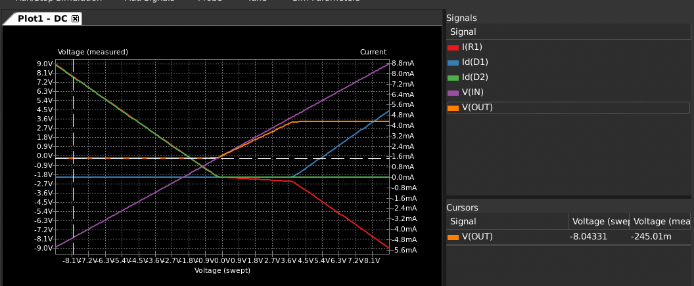

<!-- SPDX-License-Identifier: CC-BY-SA-4.0 OR MIT -->
<!-- SPDX-FileCopyrightText: Copyright 2024 Sam Blenny -->
# 02 Diode Clamp Circuits

I'm undecided about how much protection circuitry to put between the 3.5mm
jacks and the CircuitPython board's IO pins. I'm concerned about how easy it
is to touch the signal connections on a 3.5mm plug and to short the tip of the
plug against the ground of a jack. Also, there's the possibility of accidentally
connecting to analog synth gear that operates at voltages outside the absolute
maximum limits of 3.3V CMOS IO.

It would be nice to have a design that won't be easily damaged by electrostatic
discharge or accidental connections to modular synth gear. But, I don't want
the build process to be overly complicated and difficult to replicate.

Good ESD protection using TVS diodes would require a custom PCB and surface
mount soldering. Protection against connections to analog synth gear could be
done with diode clamp circuits using through-hole diodes and resistors. But,
each input channel would require 5 discrete passive components. That's a lot of
soldering. Also, testing each diode clamp to be sure none of the diodes got
installed backwards would be a lot of work.

## Context

1. EuroRack modules, semi-modular synths, and other audio synth gear use analog
   control signals in a variety of voltage ranges (-10V..10V, -5V..5V, 0V..5V,
   0V..12V, etc.). In a setup with a mix of synth gear all using 3.5mm jacks,
   accidentally connecting analog CV signals directly to a CircuitPython IO
   pin could easily damage the board.

2. It's very easy to touch the signal pins when handling 3.5mm audio plugs.
   ESD into the 3.5mm jack inputs will happen. Shorts from tip to sleeve
   (signal to ground) will happen.

## Possible Protective Circuits:

1. **Resistor**: Just put a big-ish resistor between the 3.5mm jack's tip
   (signal) pin and the CircuitPython board's IO pin. This will limit the
   current to the MCU IC's built in protective diodes. Pros: cheap, easy to
   build, probably okay for ESD protection in moderate and humid climates.
   Cons: probably not good enough for ESD in dry climates like Arizona,
   probably not good enough to prevent damage in the case of connection to
   modular synth CV/Gate signals.

2. **Diode Bridge**: For each 3.5mm jack, use a diode clamp circuit with
   current limiting resistors. Pros: decent protection against accidental
   connection to CV/Gate signals from modular synth gear, probably okay for ESD
   protection in moderate and humid climates. Cons: tedious to solder and test,
   probably not enough ESD protection for dry climates.

3. **YOLO**: Just wire the jacks straight to the IO pins and hope for the best.
   If the connection scanning algorithm makes sure to only use internal pullups,
   it might be okay. Pros: very easy to assemble. Cons: likely to have a short
   lifespan due to ESD damage.

## Diode Clamp Circuit Simulation

I made this schematic in KiCad and simulated it with ngspice to get a rough
idea of how a diode clamp circuit might perform with EuroRack-level input and
the output connected to a 3.3V CMOS GPIO pin. I used 1N5817 Schottky diodes,
1 kΩ current limiting resistors, and a 10 kΩ pull-down resistor.

I got the 1N5817 Spice model from the SMC Diodes website at
[Products &gt; Discrete &gt; Schottky-Rectifiers](https://www.smc-diodes.com/Products/Discrete/Schottky-Rectifiers).

The design goals here are:

1. Clamp the output voltage to levels that won't damage a 3.3V CMOS IO pin
   running in either input or output mode.

2. Limit clamping current to avoid overheating the diodes or subjecting
   connected equipment to a high current load (keeping in mind that 3.5mm jacks
   may short signals to ground, but we can't do anything about that).

### Schematic for diode clamp to protect one IO pin:

### Simulation screenshots for DC sweep -9V to +9V

According to this simulation, with a DC sweep of -9V to +9V on the input, the
diode clamp circuit should clamp the output voltage to stay within the range of
approximately -0.25V to +3.39V, with clamping currents of less than 9mA.

*CAUTION: This is an approximation. Don't put too much faith in these numbers.*

## Links:

These are some application notes that I found on designing diode clamp circuits:

- [Onsemi AND8231/D: Circuit Configuration Options for TVS Diodes](https://www.onsemi.com/pub/Collateral/AND8231-D.PDF)

- [TI SBAA227: System-Level Protection for High-Voltage Analog
Multiplexers](https://www.ti.com/lit/an/sbaa227/sbaa227.pdf)
