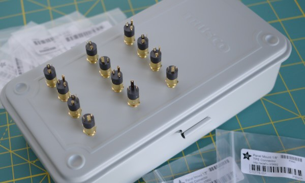
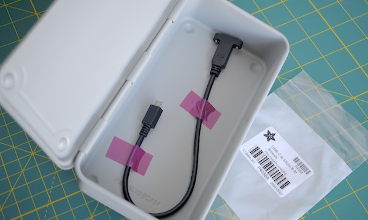
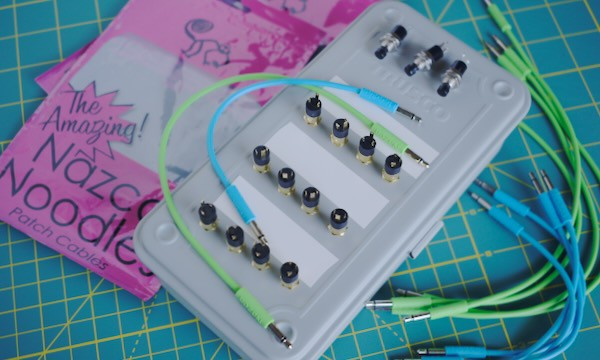

<!-- SPDX-License-Identifier: CC-BY-SA-4.0 OR MIT -->
<!-- SPDX-FileCopyrightText: Copyright 2024 Sam Blenny -->
# 05 Panel Layout

The photos below show some possible panel layout options. One of my goals is to
have room next to the 3.5mm jacks to put strips of tape for writing temporary
labels on.

The empty space on the right is for a Send-All button, and perhaps additional
buttons or knobs. I might also use some of that space to mount an I2C GPIO
expander, and maybe I2C ADC, on the underside of the lid.

If not I2C expander boards on the lid, then I will use a bundle of longer wires
routed down to a proto-board PCB on the bottom of the box. The CircuitPython
board will go on the bottom. The USB cable will go through one of the sides.

## T-190 box with twelve 3.5mm jacks

## T-190 box with panel-mount USB-C to Micro-B cable

## T-190 box with jacks, buttons, tape, and patch cables

For this one, I put tape between the rows of 3.5mm jacks and added buttons on
the right side. The cables are 15cm (green) and 25cm (blue) Nazca Noodles.

