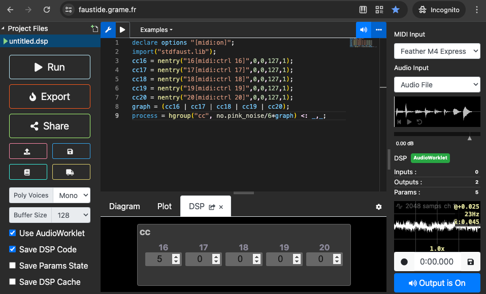

<!-- SPDX-License-Identifier: CC-BY-SA-4.0 OR MIT -->
<!-- SPDX-FileCopyrightText: Copyright 2024 Sam Blenny -->
# 06 Prototype

Before I start soldering and drilling holes, I suppose it would be sensible to
write CircuitPython code for a breadboard and flying wire prototype that talks
MIDI CC to a software synth patch.

My goal is a MIDI control surface for tactile control of software synth signal
routing with similar aesthetics to analog modular synths, but at a much lower
cost. My working plan is to scan a grid of 3.5mm patch points, translate the
resulting graph of patch cable connections into MIDI CC messages, then write
synth patches that can use MIDI CC to do adaptive signal routing.

The main risk I see for this scheme is that making a software synth patch that
can adapt its signal routing in response to MIDI CC messages may be much harder
than I expect. I think it will be a bit of a challenge, but it might actually
turn out to be really hard.

If I can't effectively make use of MIDI CC messages in a software synth patch,
then maybe I should adjust my plan for the controller build to focus more on
switches and knobs.


## Breadboard Circuit


The point of this circuit layout was to make an area on the right side of the
board where I can use flying wires (DuPont wires) to simulate a grid of patch
points using 3.5mm jacks.

I connected 5 IO pins on each side of the Adafruit Feather M4 Express board
using 10kΩ resistors for a little protection against ESD and accidental shorts.
The piece of black hookup wire on row 24 of the breadboard is to mark the left
edge of the patch panel area.

This is how I've connected the Feather M4 pins:

| M4 Pin | Breadboard row | Comment                 |
| ------ | -------------- | ----------------------- |
|     A0 | -       | use for synthio or knob? |
|     A1 | -       | use for synthio or knob? |
|     A2 | -       | use for knob/button/switch? |
|     A3 | -       | use for knob/button/switch? |
|     A4 | -       | use for knob/button/switch? |
|     A5 | -       | use for knob/button/switch? |
|    SCK | -       | use for additional patch point? |
|     MO | 29, a-e | Bottom Right of patch panel area |
|     MI | 28, a-e | |
|     RX | 27, a-e | |
|     TX | 26, a-e | |
|     D4 | 25, a-e | Bottom Left of patch panel area |
|    SDA | -       | use for I2C GPIO or ADC expanders? |
|    SCL | -       | use for I2C GPIO or ADC expanders? |
|      5 | 25, f-j | Top Left of patch panel area | |
|      6 | 26, f-j | |
|      9 | 27, f-j | |
|     10 | 28, f-j | |
|     11 | 29, f-j | Top Right of patch panel area |
|     12 | -       | use for additional patch point? |
|     13 | -       | use for indicator LED? |


See also:

- [Feather M4 Express pinouts](https://learn.adafruit.com/adafruit-feather-m4-express-atsamd51/pinouts)

- [Adafruit Feather M4 Express &gt; CircuitPython Pins and Modules](https://learn.adafruit.com/adafruit-feather-m4-express-atsamd51/circuitpython-pins-and-modules)
  (`import board; dir(board)`)


## CircuitPython Code

### Update CircuitPython

CAUTION; Following these instructions will erase any existing code on your
Feather M4 Express.

These path and shell commands below are for Terminal on macOS.

1. Download latest version of Feather M4 CircuitPython (currently 9.0.4) uf2
   file from: https://circuitpython.org/board/feather_m4_express/

2. Install CircuitPython using the bootloader, following the instructions from
   the Adafruit Learn Guide, [Adafruit Feather M4 Express &gt; CircuitPython on Feather M4 Express](https://learn.adafruit.com/adafruit-feather-m4-express-atsamd51/circuitpython)

3. Download CircuitPython library bundle to match CircuitPython version from:
   https://github.com/adafruit/Adafruit_CircuitPython_Bundle/releases/

   The full library set is too big to fit on the M4 Express CIRCUITPY drive, so
   you will need to copy specific libraries into the CIRCUITPY/lib/ folder.

   Refer to the Adafruit Learn Guide,
   [Adafruit Feather M4 Express &gt; CircuitPython Libraries](https://learn.adafruit.com/adafruit-feather-m4-express-atsamd51/circuitpython-libraries)

4. Expand the library bundle:

   ```
   $ cd Downloads
   $ unzip adafruit-circuitpython-bundle-9.x-mpy-20240514
   ```

5. Install adafruit_midi library:

   ```
   $ mkdir -p /Volumes/CIRCUITPY/lib
   $ cd /Downloads/adafruit-circuitpython-bundle-9.x-mpy-20240514
   $ cp -r lib/adafruit_midi /Volumes/CIRCUITPY/lib/
   ```


### Code to scan jacks and send MIDI CC

To enable USB MIDI on the Feather M4 Express, put this in [boot.py](boot.py):

```
import usb_hid, usb_midi

usb_hid.disable()
usb_midi.enable()
```

Then, put this in [code.py](code.py):
```
from board import D4, D5, D6, D9, D10, D11, TX, RX, MISO, MOSI
from digitalio import DigitalInOut, DriveMode, Pull
import gc, time, usb_midi
import adafruit_midi
from adafruit_midi.control_change import ControlChange


# === Config Section ===

INS = (D5, D6, D9, D10, D11)     # Feather "input jack" pins
OUTS = (D4, TX, RX, MISO, MOSI)  # Feather "output jack" pins
CC_LIST = (16, 17, 18, 19, 20)   # MIDI CC numbers for OUTS

MIDI_CH = 0         # MIDI channel: 0 is ch1, 15 is ch16
DEBUG = True        # enable for debug prints to console
DELAY_LOOP = 0.005  # delay (s) between scanning jacks
DELAY_MIDI = 0.002  # delay (s) between MIDI sends (avoid bursts)
SEND_ALL_T = 5.0    # interval (s) between automatic send-all
DELAY_RC = 0.002    # settle time (s) after changing pin drive

# ======================

# MIDI setup
m = adafruit_midi.MIDI(midi_out=usb_midi.ports[1], out_channel=MIDI_CH)
gc.collect()

# Input and Output pins: start with everything pulled low
in_pins  = [DigitalInOut(p) for p in INS]
out_pins = [DigitalInOut(p) for p in OUTS]
for p in in_pins:
  p.switch_to_input(pull=Pull.DOWN)
for p in out_pins:
  p.switch_to_output(value=False, drive_mode=DriveMode.OPEN_DRAIN)
gc.collect()

# Arrays to hold graph of output to input connections
graph   = [0] * len(out_pins)
changes = [0] * len(out_pins)
gc.collect()

def set_pins_low():
  """Pull all pins LOW to reduce leakage and drain stray charges."""
  for p in in_pins:
    p.pull = Pull.DOWN
  for p in out_pins:
    p.value = False

def set_pins_highz():
  """Set IO pins HIGH-Z to avoid creating weird resistor networks."""
  for p in in_pins:
    p.pull = None
  for p in out_pins:
    p.value = True

def map_graph():
  """Map the connection graph of output pins to input pins.

  With 10k resistors on all the IO pins, and driving HIGH levels only
  with internal pullups, this acts a little odd. I guess it's kind of
  an RC network? It seems marginally better behaved if I leave
  un-involved pins HIGH-Z during measurements and drain stray charge
  before and after.
  Pros: resistors are cheap protection from shorts and also provide
        some (very limited) ESD protection
  Cons: seems to need management of stray charge to get good inputs
  """
  for (i, op) in enumerate(out_pins):
    reg = 0
    # shift input connections into register
    for ip in in_pins:
      set_pins_highz()             # set everything HIGH-Z
      op.value = False             # drive only current output LOW
      ip.pull = Pull.UP            # pull only current input pin HIGH
      time.sleep(DELAY_RC)         # wait for voltage to settle
      reg <<= 1
      reg |= 0 if ip.value else 1  # read input
      set_pins_low()               # set pins LOW (drain stray charge)
      time.sleep(DELAY_RC)
    changes[i] = graph[i] ^ reg    # find changed edges with XOR
    graph[i] = reg                 # store current edges

# Reset: scan pins and prepare to send all CC values
map_graph()
send_all = True;
t_prev = time.monotonic()

# Main Loop: sleep, scan pins, send CC messages when needed
while True:
  gc.collect()
  time.sleep(DELAY_LOOP)
  map_graph()
  # Send all the CC values at regular intervals (but not too often)
  t = time.monotonic()
  if t - t_prev > SEND_ALL_T:
    t_prev = t
    send_all = True
    if DEBUG:
      print()
  # Also send CC values when the graph changes
  for (i, (diff, cc, val)) in enumerate(zip(changes, CC_LIST, graph)):
    if diff or send_all:
      m.send(ControlChange(cc, val))
      time.sleep(DELAY_MIDI)
      if DEBUG:
        print(f"{cc}: {val:05b}")
  send_all = False
```


## Software Synth Patch

This is a basic Faust dsp patch (also available as
[cc-receiver.dsp](cc-receiver.dsp)) that you can copy and paste into the
[Faust web IDE](https://faustide.grame.fr/). I tested this with Chrome
on macOS. FWIW, some places claim that Web MIDI only works on Chrome.

Anyhow, if you run the boot.py and code.py above on a Feather M4 (or other
suitable board), and if Web MIDI works in your browser, you should see the name
of the board you are using in the "MIDI Input" control in the right sidebar of
the Faust IDE.

This is the Faust dsp code:

```
// This MIDI CC decoder listens to 5 MIDI CC controls, where the value of each
// control represents the graph edges from one "output jack" to each of 5
// possible "input jacks". For example, cc16 == 5 (0b00101) means output D4 is
// connected to inputs D11 (0b00001) and D9 (0b00100)

declare options "[midi:on]";
import("stdfaust.lib");
cc16 = nentry("16[midi:ctrl 16]",0,0,127,1);
cc17 = nentry("17[midi:ctrl 17]",0,0,127,1);
cc18 = nentry("18[midi:ctrl 18]",0,0,127,1);
cc19 = nentry("19[midi:ctrl 19]",0,0,127,1);
cc20 = nentry("20[midi:ctrl 20]",0,0,127,1);
graph = (cc16 | cc17 | cc18 | cc19 | cc20);
process = hgroup("cc", no.pink_noise/6*graph) <: _,_;
```

When it runs, it looks like this:



As you change connections on the patch panel area of your breadboard, you
should see the numbers change in the `cc16` to `cc20` number entry UI
elements. The volume of the audio (pink noise) will also change in response to
the OR of all the CC values.


## Documentation Links


### Adafruit Guides

1. [Adafruit Feather M4 Express](https://learn.adafruit.com/adafruit-feather-m4-express-atsamd51)

2. [MIDI Melody Maker &gt; CircuitPython on Feather M4 Express](https://learn.adafruit.com/midi-melody-maker/circuitpython-on-feather-m4-express)


### CircuitPython Documentation

1. [usb_midi readthedocs](https://docs.circuitpython.org/en/9.0.x/shared-bindings/usb_midi/index.html)

2. [adafruit_midi readthedocs](https://docs.circuitpython.org/projects/midi/en/stable/api.html)

3. [digitalio](https://docs.circuitpython.org/en/9.0.x/shared-bindings/digitalio/index.html)
