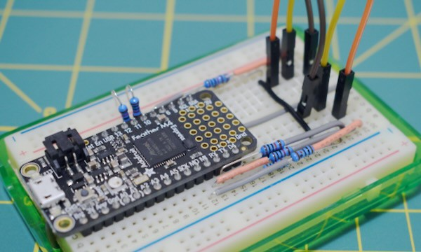

<!-- SPDX-License-Identifier: CC-BY-SA-4.0 OR MIT -->
<!-- SPDX-FileCopyrightText: Copyright 2024 Sam Blenny -->
# 06 Prototype

Before I start soldering and drilling holes, I suppose it would be sensible to
write CircuitPython code for a breadboard and flying wire prototype that talks
MIDI CC to a software synth patch.

My goal is a MIDI control surface for tactile control of software synth signal
routing with similar aesthetics to analog modular synths, but at a much lower
cost. My working plan is to scan a grid of 3.5mm patch points, translate the
resulting graph of patch cable connections into MIDI CC messages, then write
synth patches that can use MIDI CC to do adaptive signal routing.

The main risk I see for this scheme is that making a software synth patch that
can adapt its signal routing in response to MIDI CC messages may be much harder
than I expect. I think it will be a bit of a challenge, but it might actually
turn out to be really hard.

If I can't effectively make use of MIDI CC messages in a software synth patch,
then maybe I should adjust my plan for the controller build to focus more on
switches and knobs.

## Breadboard Circuit

The point of this circuit layout was to make an area on the right side of the
board where I can use flying wires (DuPont wires) to simulate a grid of patch
points using 3.5mm jacks.

I connected 5 IO pins on each side of the Adafruit Feather M4 Express board
using 10kΩ resistors for a little protection against ESD and accidental shorts.
The piece of black hookup wire on row 24 of the breadboard is to mark the left
edge of the patch panel area.

This is how I've connected the Feather M4 pins:

| M4 Pin | Breadboard row | Comment                 |
| ------ | -------------- | ----------------------- |
|     A0 | -       | use for synthio or knob? |
|     A1 | -       | use for synthio or knob? |
|     A2 | -       | use for knob/button/switch? |
|     A3 | -       | use for knob/button/switch? |
|     A4 | -       | use for knob/button/switch? |
|     A5 | -       | use for knob/button/switch? |
|    SCK | -       | use for additional patch point? |
|     MO | 29, a-e | Bottom Right of patch panel area |
|     MI | 28, a-e | |
|     RX | 27, a-e | |
|     TX | 26, a-e | |
|     D4 | 25, a-e | Bottom Left of patch panel area |
|    SDA | -       | use for I2C GPIO or ADC expanders? |
|    SCL | -       | use for I2C GPIO or ADC expanders? |
|      5 | 25, f-j | Top Left of patch panel area | |
|      6 | 26, f-j | |
|      9 | 27, f-j | |
|     10 | 28, f-j | |
|     11 | 29, f-j | Top Right of patch panel area |
|     12 | -       | use for additional patch point? |
|     13 | -       | use for indicator LED? |

## CircuitPython Code

**TODO**

## Software Synth Patch

**TODO**
